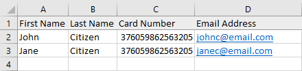

# AmEx-Offer-Saver

This program will save you time by automatically registering all your cards into an AmEx offer of your choice.

## Getting Started

These instructions will get you a copy of the project up and running on your local machine.

### Requirements

```
Python3
```
[Download and install Python3](https://www.python.org/download/releases/3.0/?)

### Installing Library Requirements

1. Open Powershell (Windows) or Terminal (macOS/Linux)
2. Copy and paste the following (right click in Powershell/Terminal to paste) or type it in manually
```
pip install openpyxl beautifulsoup4
```
3. Press "Enter" and all 3 packages will start to download and install

## Using the Excel sheet

The Excel sheet is simple to use. Leave the first row as it is and **only edit** the rows you need. First name goes in column A, last name goes in column B, card number goes in column C, and email address goes in column D.

See the following example for reference:



## Running the program

1. Download the .zip file [here](https://github.com/nerces/AmEx-Offer-Saver/archive/master.zip)
2. Go to the directory you downloaded the file and extract the file to a folder
3. Right click the folder -> Properties -> highlight all the text to the right of "Location:" -> right click -> copy
4. Open Powershell (Windows) or Terminal (macOS/Linux)
5. Type in "cd" and then right click to paste the path - eg.
```
cd <paste path here>
```
It will then look something like:
```
cd C:\Users\YourUsername\Desktop\AmEx-Offer-Saver
```
6. Once you're in the folder, it's time to run the actual program. Type in the following:
```
python main.py
```
7. The program will do its thing and then ask for your input. Read the onscreen instructions and you're all ready to go!

## Built With

* [BeautifulSoup4](https://pypi.org/project/beautifulsoup4/)
* [openpyxl](https://bitbucket.org/openpyxl/openpyxl/overview)

## License

This project is licensed under the MIT License - see the [LICENSE.md](LICENSE.md) file for details

---------------------------------------
## To-Do

- [x] Headless driver  
- [ ] Failsafe for user input  
- [ ] Choose multiple offers at a time  
- [x] Add checking system to track successful/failed registrations  
- [ ] GUI
